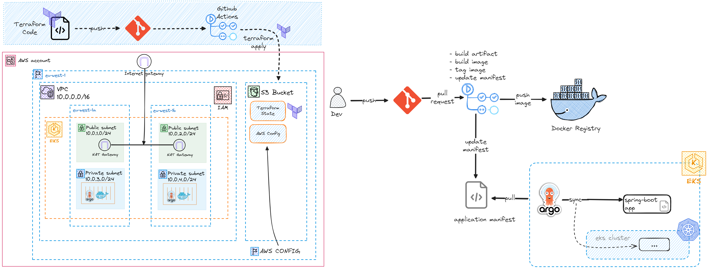

# Spring Boot Application Deployment - GitOps (AWS EKS-TERRAFORM-ARGOCD-GITHUB-ACTIONS)


## Overview: 
This project demonstrates how to deploy and manage a Spring Boot application using GitHub Actions, ArgoCD, Terraform, and AWS EKS.

## Project Structure
- `.github/workflows`: Contains GitHub Actions workflows, automating CI/CD pipelines.
- `infra`: Terraform configuration for AWS Network components (VPC, Subnets, etc) AWS EKS cluster along with IAM roles to manage it.
- `argocd`: ArgoCD manifests for continuous deployment and application configuration.
- `kube_manifest`: Kubernetes manifests for Spring Boot application deployment and management.
- `backend`: Terraform Configuration for remote S3 backend , essential for tracking infrastructure changes and maintaining version control.
- `app`: Spring Boot application along with Dockerfile for containerization.

## Secrets to configure

| Secret Name       | Type     | Description                                |
|-------------------|----------|--------------------------------------------|
| `AWS_ACCOUNT_ID`  | `string` | User's AWS Account ID or ARN.              |

| Secret Name       | Type     | Description                                |
|-------------------|----------|--------------------------------------------|
| `IAM_USER`        | `string` | Name of the IAM user.                      |

| Secret Name       | Type     | Description                                |
|-------------------|----------|--------------------------------------------|
| `PIPELINE_ROLE`   | `string` | ARN of the OIDC Role configured in AWS.   |

| Secret Name       | Type     | Description                                |
|-------------------|----------|--------------------------------------------|
| `DOCKER_USERNAME` | `string` | DockerHub account username.                |

| Secret Name       | Type     | Description                                |
|-------------------|----------|--------------------------------------------|
| `DOCKER_PASSWORD` | `string` | DockerHub account password.                |

## Variables to configure

| Secret Name       | Type     | Description                                |
|-------------------|----------|--------------------------------------------|
| `BUCKET_NAME`     | `string` | S3 bucket name for initializing the S3 backend. (Used in the `init_s3_backend.yaml` workflow) |

| Secret Name       | Type     | Description                                |
|-------------------|----------|--------------------------------------------|
| `CLUSTER_NAME`    | `string` | Name of the EKS cluster (must match the configuration in Terraform). Used in the `deploy_argocd_app.yaml` workflow. |


## Workflow Steps:
1- Configure remote terraform backend (init_s3_backend.yaml)
2- Deploy AWS infrastructure (deploy_infra.yaml)
3- Configure ArgoCD (deploy_argocd.yaml)
4- Deploy Spring Boot Application (deploy_argocd_app.yaml)
5- CI/CD pipeline for Spring Boot Application (deploy_app.yaml)

## Local setup:
To test the Spring Boot application locally:
```bash
mvn spring-boot:run
```

## Note: 
This project is for dev & testing purposes, ensure to destroy AWS resources upon completion to prevent any additional charges.
